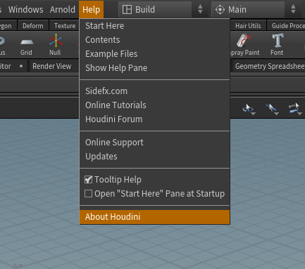
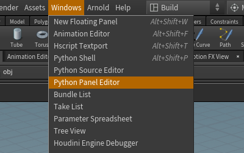

# HCollector

Houdini python panel tool for automatically sorting and collecting files from \*.hip files

  

- Search for missing files. Automatically fixes broken links.
- Fixes absolute path to $HIP
- Detects file sequenses
- Collects all external files
- Collects Custom Attributes
- Generates text report
- Creates ZIP archive    

If you spot any bugs, please feel free to send me an email at gammany@gmail.com

How to Install:

1. Choose proper Qt version corresponding to your Houdini build.
  
  To find which version to use go to Help > About
  
  
  
  
2. Copy 'python_panels' and 'scripts' foldiers from 'QTx' folder into your Houdini settings folder %USERPROFILE%\Documents\houdiniXX.X

3. Inside Houdini go to the Windows > Python Panel Editor

  

4. On 'Pane Tab Menu' choose the tool on the left panel and click the right arrow to transfer it to the right panel. 

  

5. Hit accept

6. Now it is available in the 'New Pane Tab Type Menu'.

  

Help:

Coming soon
